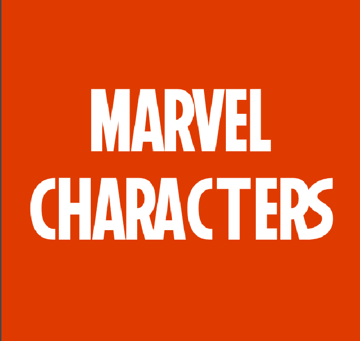
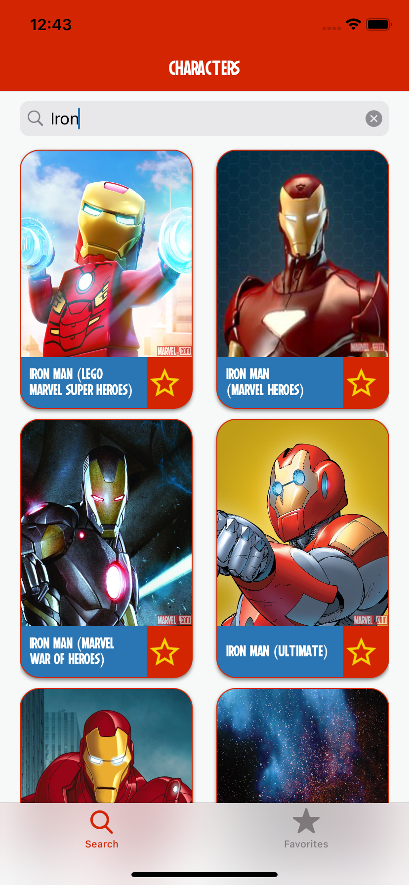

# Marvel Characters
Projeto de um aplicativo iOS para consultar detalhes dos personagens marvel como as séries e quadrinhos onde eles aparecem, bem como selecionar seus favoritos para consulta offline.

## Screenshots iPhone
Personagens | Filtar | Favoritos | Detalhes
:-:|:-:|:-:|:-:
  |   |  |  

## Screenshots iPhone 
Lista Vazia | API | Internet | Loading
:-:|:-:|:-:|:-:
  |   |  | 

## Screenshots iPad Portrait
Personagens | Detalhes
:-:|:-:
  |  

## Screenshots iPad Landscape
Personagens

## Funcionalidades
* Lista de Personagens
* Detalhes do personagem com a lista de séries e quadrinos
* Lista de personagens favoritados com consulta offline.
* Widget com os três primeiros personagens

## Solução
* Todas as views criadas programaticamente, com componentes e reutilização.
* Testes de snapshot
* Arquitetura Clean Swift
* CoreData para persitência de dados
* Implementação camada de network sem dependência externa.
* Cache de imagens com Kingfisher
* Fastlane para geração de relatório de cobertura
* Internacionalização para Português e Inglês
* Font customizada.

## Author
Victor Tavares, victorostavares@gmail.com
