# Marvel Characters
Projeto de um aplicativo iOS para consultar detalhes dos personagens marvel como as séries e quadrinhos onde eles aparecem, bem como selecionar seus favoritos para consulta offline.

## Screenshots iPhone
Personagens | Favoritos | Detalhes | Widget
:-:|:-:|:-:|:-:
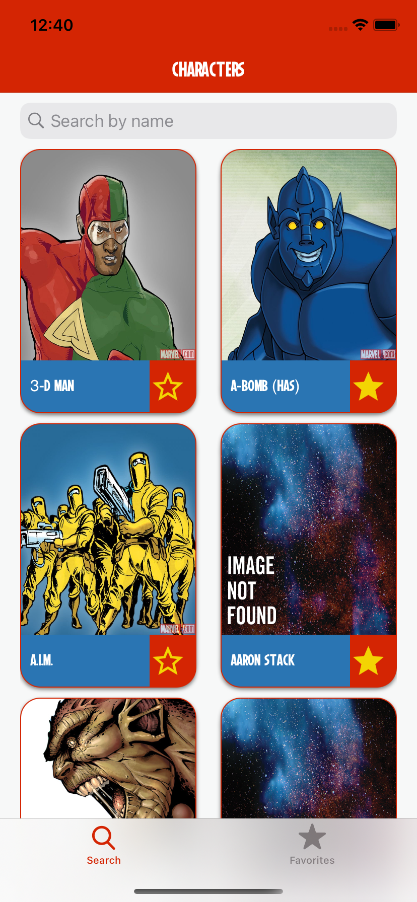  |  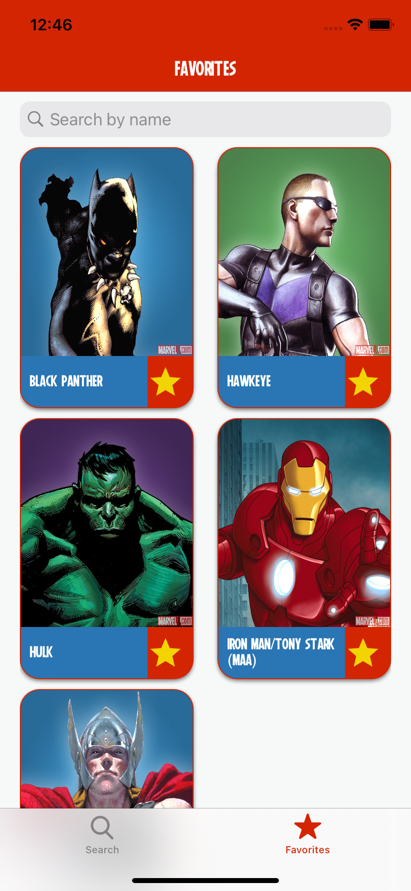 | 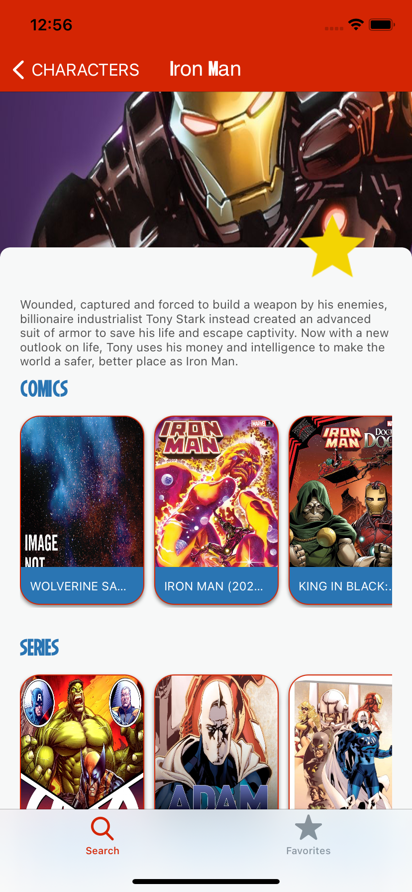 | 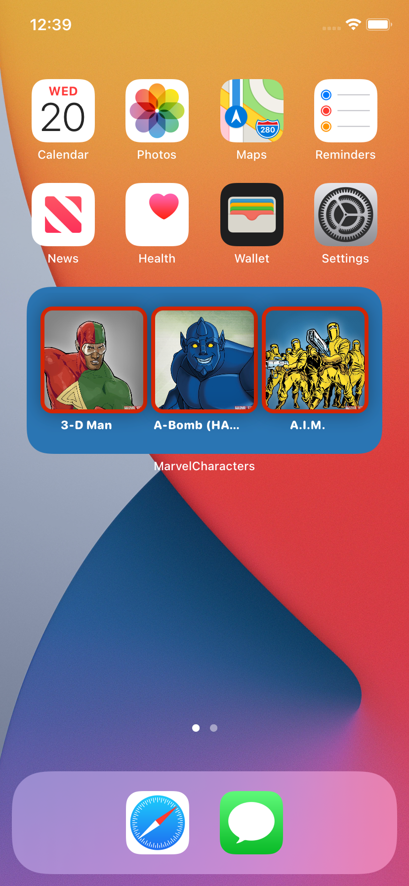

## Screenshots iPhone 
Lista Vazia | API | Internet | Loading
:-:|:-:|:-:|:-:
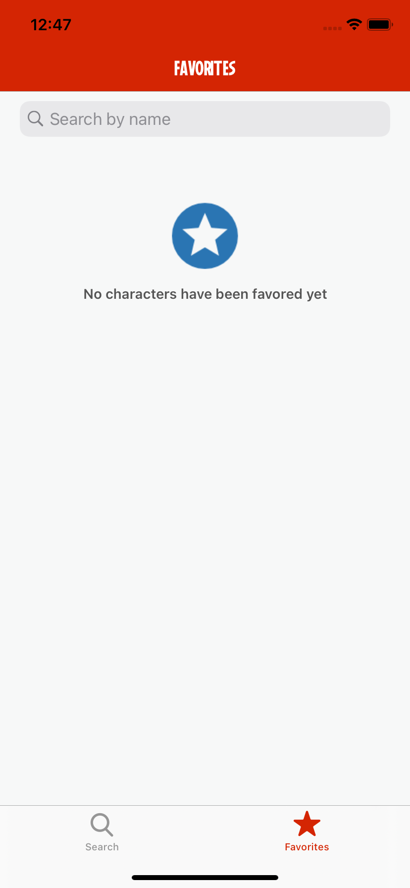  |  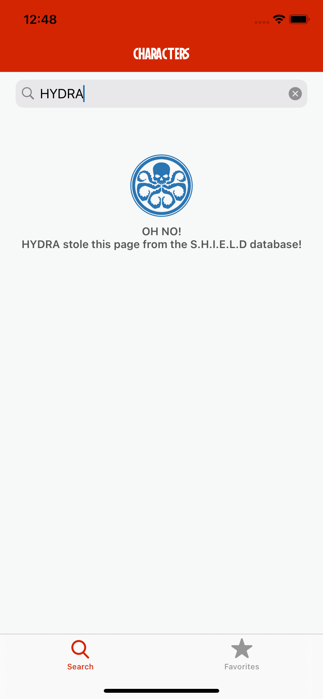 | 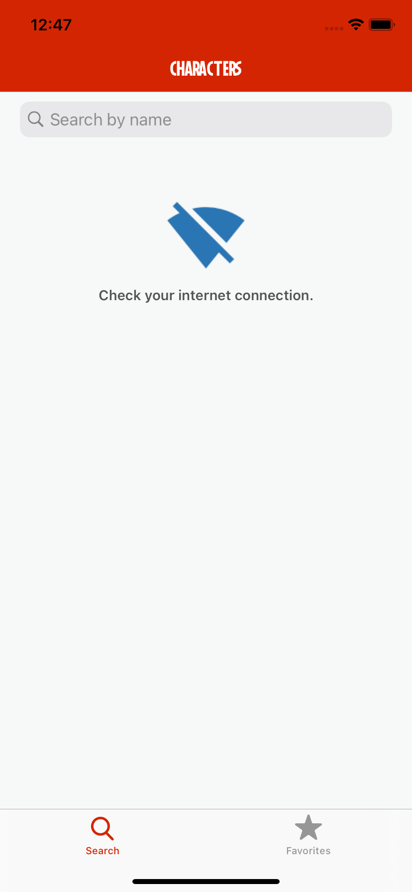 | 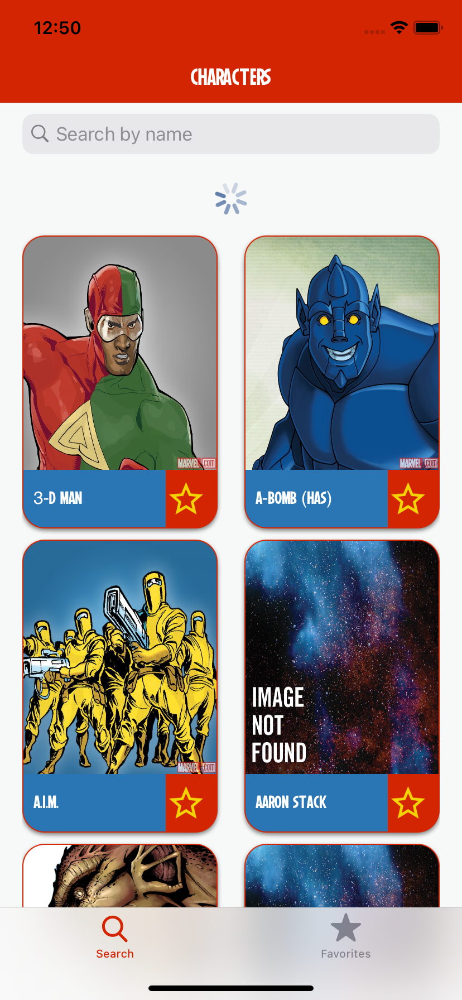

## Screenshots iPad Portrait
Personagens | Detalhes
:-:|:-:
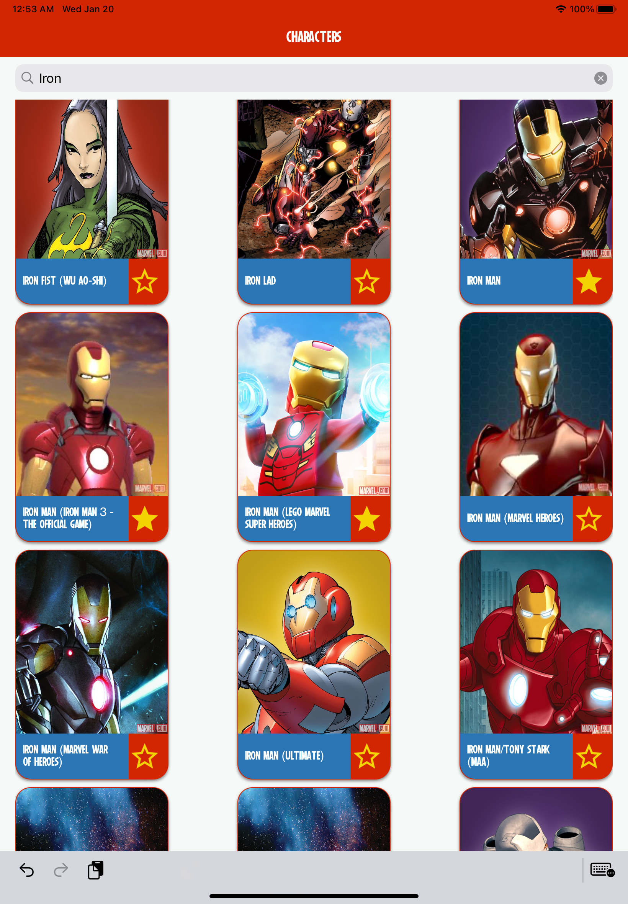  |  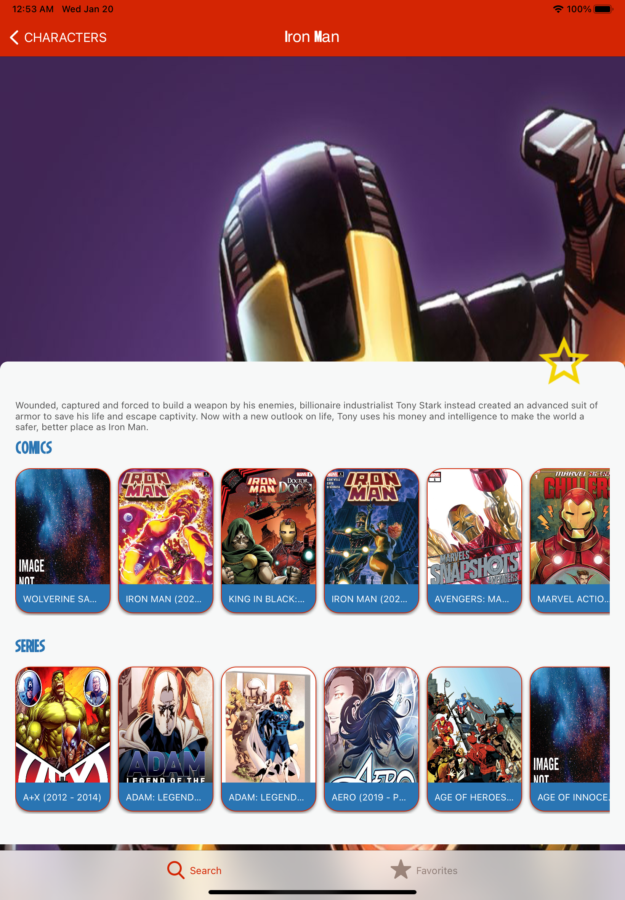

## Screenshots iPad Landscape
Personagens

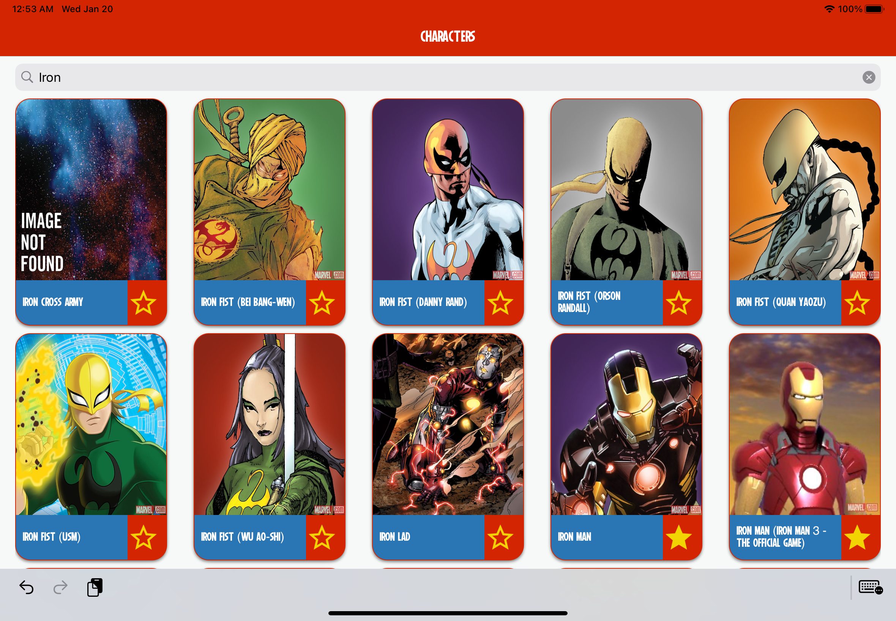

## Funcionalidades
* Lista de Personagens
* Detalhes do personagem com a lista de séries e quadrinos
* Lista de personagens favoritados com consulta offline.
* Widget com os três primeiros personagens

## Solução
* Todas as views criadas programaticamente como componentes e com reutilização.
* Testes de snapshot
* Arquitetura Clean Swift
* CoreData para persitência de dados
* Implementação camada de network sem dependência externa.
* Cache de imagens com Kingfisher
* Fastlane para geração de relatório de cobertura
* Internacionalização para Português e Inglês
* Fonte customizada.

## Setup
* Cocoapods 1.9.3
* Xcode 12.0.1
* Swift 5.0
* iOS 13.0
* Fastlane 2.171.0

## Bibliotecas 
* Kingfisher 6.0.0
* iOSSnapshotTestCase 6.2.0

## Como Executar
* Instalar Cocoapods
* Executar pod install
* Abrir MarvelCharacters.xcworkspace

## Schemes
* MarvelCharacters (App + Unit Tests)
* MarvelCharactersWidget (Widget)

## Author
Victor Tavares, victorostavares@gmail.com
